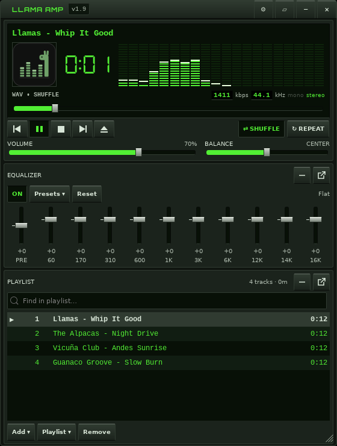

# Llama Amp 🦙

[](https://github.com/jeremyperson/llama-amp/releases/latest)
[](https://github.com/jeremyperson/llama-amp/actions)
[](LICENSE)

**[Website](https://jeremyperson.github.io/llama-amp/)** · A Winamp-inspired music player for Linux with compact, tactile controls. Pure
Python/GTK3/GStreamer — no build step, no framework, just lines that whip.



## Classic interface

The main display has a dedicated 20-column spectrum analyzer: fast-rising LED
bars with bright peak caps that hold briefly and fall slowly. The ten-band EQ
has separate keyboard-accessible sliders, zero marks, visible presets and Reset.
The inset wordmark includes a recessed version badge. A shorter EQ and playlist
header leave room for seven complete tracks at 560 × 740, with separate Volume
and Balance groups and a larger now-playing title.

- **Double-click the title bar** (or click ▱) for the narrow windowshade player.
- **Ctrl+D** toggles Winamp-style double size: everything at 2×, pixel for pixel.
- **− / +** on each panel collapses/expands it; the adjacent window icon detaches
  it and changes to a docking icon for reattachment. Each has a descriptive tooltip.
  Detached panels snap within 12 pixels on X11. Drag the player to move panels
  joined beneath it; hold Alt to separate them. Wayland uses explicit attachment
  and independent windows. **Settings → View → Reset layout** restores the stack.
- **Click the analyzer** to cycle spectrum, oscilloscope and off.
- **Settings → Theme** switches between Llama Green, Classic Silver and Amber.
  **Visualization** controls the mode, peak caps, colors and falloff speed.
- Drag the visible grip in the lower-right corner to resize. The playlist grows
  with the window; detached panels have the same grip.
- **Add ▾** contains files, folders and stream URLs. **Playlist ▾** contains
  saved playlists, Sort (title, artist, album, filename, path, length, reverse,
  randomize), export, missing-file removal, Clear and Undo.
- **Ctrl+Z** undoes up to 20 playlist edits during the session. Restoring a cleared
  playlist does not automatically start playback. Queue markers show play order;
  **▶** means playing and **Ⅱ** means paused. Stopped tracks have no playback
  marker, and selection stays independent of playback.
- Playlist rows use embedded track titles when available, with the filename stem
  as a fallback. Hover a row for its full path. Background title updates preserve
  selection, duplicate entries, and the queue; search follows the displayed titles.
- Click the clock for elapsed/remaining time. Double-click an EQ slider to reset
  its gain or Balance to center it. Arrow keys adjust a focused slider or move
  through the playlist; global seek/volume shortcuts apply elsewhere.
- The EQ status shows the active preset or Custom, **Equalizer off**, or
  **Bypassed · Direct Mode**. Bypassed sliders are dimmed but remain editable;
  moving them stores settings for later. Direct Mode disables the EQ power button.

## Media Library

**Alt+L** opens the library: add the folders where your music lives and
browse it by genre, artist and album, or search titles, artists, albums and
genres as you type. Smart views list recently added, most played and never
played tracks. **Play** swaps the playlist for your selection (Ctrl+Z brings
the old one back), **Enqueue** and **Play next** add to it, and tracks can be
dragged onto the playlist. The index refreshes incrementally at startup, and
every listen past half a track (or four minutes) adds to its play count.

[The Media Library](screenshots/llama-amp-library.png)

## Lyrics

**Alt+Y** shows the playing track's lyrics from an `.lrc` file with the same
name next to it (`Song.flac` → `Song.lrc`) or from lyrics in its tags. Synced
`.lrc` lyrics highlight the current line as the song plays. Nothing is
looked up online.

## Internet radio

**Alt+R** (or **Add ▾ → Internet radio…**) browses the
[radio-browser.info](https://www.radio-browser.info/) directory: the most
voted stations, a search by name or genre, and your favorites (☆). Play or
Enqueue adds the station to the playlist under its name.

[The Internet Radio window](screenshots/llama-amp-radio.png)

## Editing tags

**Alt+3** (File Info) shows a track's tags, audio format and file details.
With `python3-mutagen` installed, **Edit Tags** changes the title, artists,
album, album artist, track and disc numbers, year, genre and comment of
FLAC, MP3, Ogg Vorbis, Opus and M4A files; the playlist, the now-playing
display and the library pick up the change right away.

## Classic skins

**Settings → Skin** switches to classic mode: Winamp 2's main window, equalizer
and playlist editor, drawn from real `.wsz` skins — shaped skins, skin fonts,
visualizer and playlist colors included. Drag a `.wsz` file onto the player to
install and wear it, or pick **Find skins** to browse the
[Winamp Skin Museum](https://skins.webamp.org/). The built-in "Llama" classic
skin is an original design. The windows dock under each other (drag one away
to float it), double-click a title bar to shade, and Ctrl+D doubles them.

[Classic mode with the built-in skin](screenshots/llama-amp-classic.png)

[Classic Silver](screenshots/llama-amp-silver.png) ·
[Amber](screenshots/llama-amp-amber.png) ·
[Windowshade](screenshots/llama-amp-windowshade.png)

Screenshots use demonstration track labels and generated test audio.

## Features

**Playback**
- Gapless playback (GStreamer `about-to-finish` handoff)
- Crossfade (2–10 s, equal-power) when playing through the desktop mixer
- ReplayGain volume normalization (track/album modes, rgvolume + limiter).
  Tracks without ReplayGain tags are measured in the background and play at
  a matching level; files are never modified (⚙ → ReplayGain → Measure
  Untagged Files)
- Internet radio: open SHOUTcast/Icecast URLs (`Ctrl+L`) with live ICY
  now-playing titles and buffering handling
- **Direct Mode**: bit-transparent output — the EQ/balance DSP chain is fully
  detached while the spectrum analyzer keeps running (pure passthrough analysis)
- **ALSA direct output**: exclusive `hw:` access to your DAC, bypassing the
  PulseAudio/PipeWire mixer and its resampling — with automatic busy-device
  retry and graceful fallback
- 10-band equalizer with visible presets, plus a separate live spectrum
  analyzer with segmented meters and falling peak caps
- Shuffle by tracks or whole albums, tri-state repeat (off / all / one),
  sleep timer (after track or 15/30/60 min), stop-after-current
  (right-click the stop button)

**Library & playlists**
- Album art: embedded tags → folder art (`cover.jpg` etc.) → placeholder
- Playlist with durations + total time, zebra striping, drag-reorder,
  multi-select, find-and-jump search, Undo, and a Play Next queue (right-click)
- Shared navigation for Next, media keys and gapless playback; shuffle Previous
  returns through playback history. Duplicate files remain distinct entries.
- Named playlists, M3U import/export, recursive folder add,
  missing-file detection and cleanup
- Drag & drop files or folders straight onto the window
- Scrolling marquee for long titles on the LCD panel

**Desktop integration**
- MPRIS2: media keys, lock-screen and panel controls with title + cover art
- Tray icon (AppIndicator with StatusIcon fallback) and track-change
  desktop notifications
- ListenBrainz scrobbling (paste your user token in ⚙ → Scrobbling)
- ALSA output device picker for the bit-perfect direct mode
- Open audio files from your file manager ("Open With → Llama Amp")
- Update notifications: checks GitHub Releases at startup and daily, with
  one-click install from the ⚙ menu (installed copies download the new .deb
  and hand it to the system installer; opt out via
  ⚙ → "Check for Updates on Startup")
- Keyboard shortcuts: Winamp's `Z` `X` `C` `V` `B` (previous · play · pause ·
  stop · next) · `Space` play/pause · `←/→` seek ±5s · `↑/↓` volume ·
  `S` shuffle · `R` repeat · `J` jump to file · `Ctrl+J` jump to time ·
  `Ctrl+T` elapsed/remaining · `Ctrl+D` double size · `Alt+3` file info and tag editing · `Alt+Y` lyrics · `Alt+R` internet radio ·
  `Ctrl+O` add files · `Ctrl+L` open URL ·
  `Del` remove from playlist

## Running

Portable (no install):

```bash
git clone https://github.com/jeremyperson/llama-amp.git && cd llama-amp
sudo apt install python3-gi python3-gi-cairo gir1.2-gtk-3.0 \
  gir1.2-gstreamer-1.0 gir1.2-gst-plugins-base-1.0 \
  gstreamer1.0-plugins-good gstreamer1.0-alsa gstreamer1.0-pulseaudio
python3 musicPlayer.py [files...]
```

In portable mode, settings live next to the script. Optional: install the
[DSEG7 Classic](https://github.com/keshikan/DSEG) and
[Orbitron](https://fonts.google.com/specimen/Orbitron) fonts (both OFL) for
the authentic LED clock and wordmark — the app degrades gracefully without.

For an isolated preview, set `LLAMAAMP_DATA_DIR` to a different writable directory.
Existing settings and playlists remain compatible; layout and theme preferences
are saved alongside them. Queue, Undo and shuffle history last for the session.

## Installing

**Debian/Ubuntu/Mint — apt repository** (recommended; updates arrive with
`apt upgrade`):

```bash
curl -fsSL https://jeremyperson.github.io/llama-amp-apt/llama-amp.gpg | sudo tee /usr/share/keyrings/llama-amp.gpg > /dev/null
echo "deb [signed-by=/usr/share/keyrings/llama-amp.gpg] https://jeremyperson.github.io/llama-amp-apt stable main" | sudo tee /etc/apt/sources.list.d/llama-amp.list
sudo apt update && sudo apt install llama-amp
```

Or build the .deb yourself (fonts are fetched automatically):

```bash
./packaging/build-deb.sh
sudo apt install ./packaging/dist/llama-amp_*.deb
```

**Other distros** — a Flatpak manifest is provided; see
[`packaging/README.md`](packaging/README.md).

Installed copies keep settings in `~/.config/llamaamp/` and notify you
in-app when a new release is available (update straight from the ⚙ menu).

## Contributing

Bug reports, feature ideas, and PRs are welcome — see
[CONTRIBUTING.md](CONTRIBUTING.md) for the dev setup and the (few) ground
rules. The short version: it runs on a stock GTK3/GStreamer stack with no
build step, and we'd like to keep it that way.

## License

MIT (see [LICENSE](LICENSE)). Bundled at package-build time: DSEG7 Classic
and Orbitron fonts, both under the SIL Open Font License 1.1.
